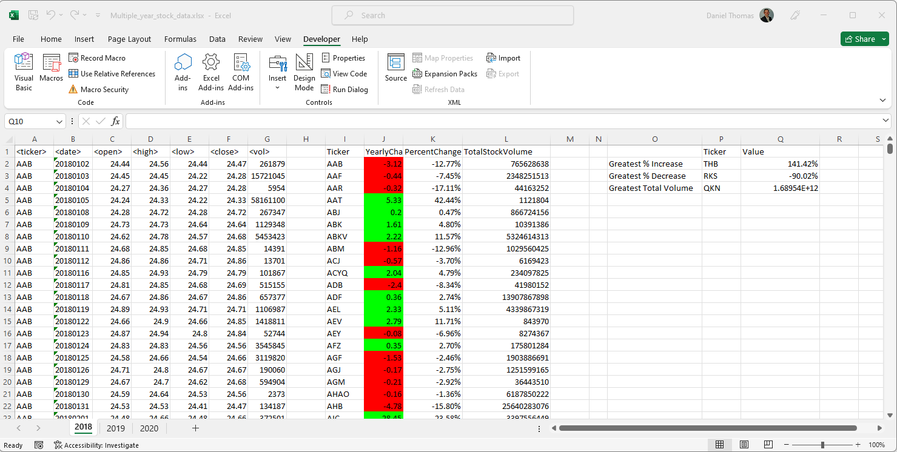
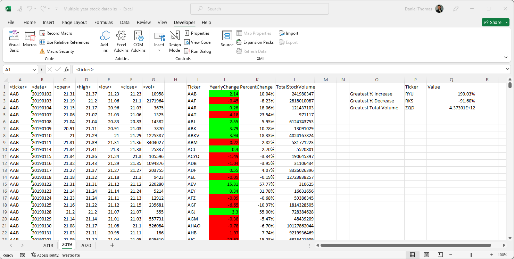
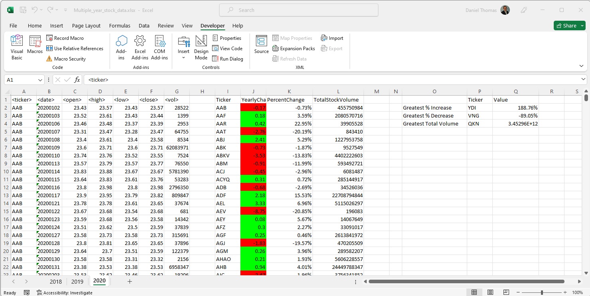

# VBA-Challenge
This project required me to loop through all stocks in the Multiple_year_stock_data.xlsx file provided to me and calculate the yearly change from opening price and closing price. I also had to calculate the cahnge in another column and format the cells to represent a positive or negative change. I had to calculate the total stock volume for all tickers as well. Finally documenting the greatest increase, decrease and greatest total volume was required. This process also needed to work on all sheets in the workbook. 

Credit to Simon Rennocks (tutor session) for assistance in code fixes for year open calculations as well as percentage cell formats and general code readability modifications.

